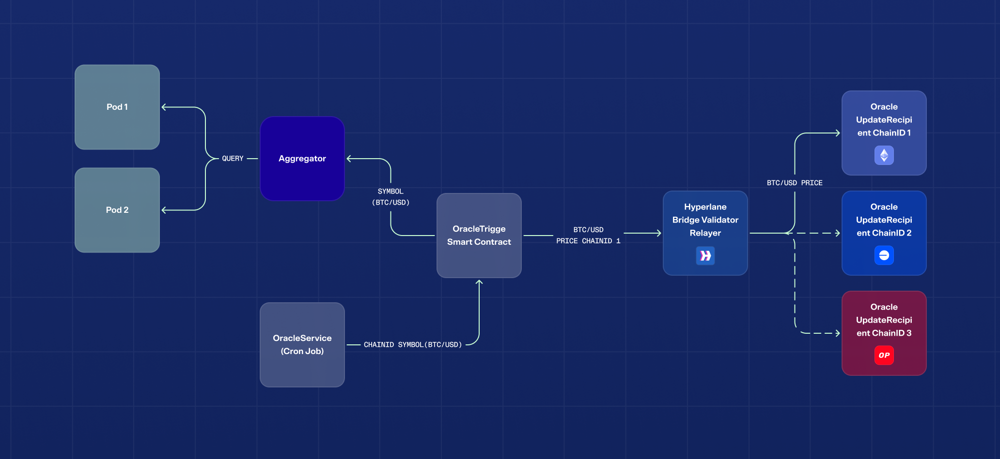
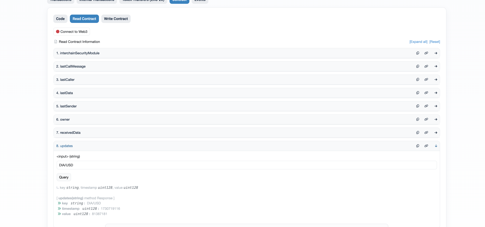
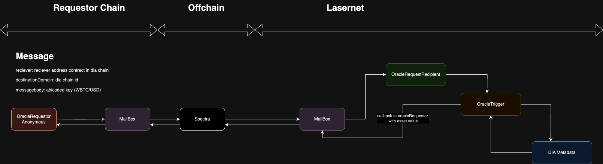

## Table of Contents

- [Spectra](#spectra)
  - [Components](#components)
    - [OracleTrigger Smart Contract](#1-oracletrigger-smart-contract)
    - [OracleUpdateRecipient Smart Contract](#2-oracleupdaterecipient-smart-contract)
    - [OracleService](#3-oracleservice)
  - [Spectra Flow](#spectra-flow)
- [Push-Based Oracle](#push-based-oracle)
  - [Usage](#usage)
    - [Method 1: Separate Oracle Contract](#method-1-separate-oracle-contract)
    - [Method 2: Direct Delivery to Contracts](#method-2-direct-delivery-to-contracts)
  - [Access Oracle](#access-dias-oracle)
- [Request-Based Oracle](#request-based-oracle)
  - [How It Works](#how-it-works)
    - [Request Creation](#request-creation)
    - [Request Body Format](#request-body-format)
    - [Message Delivery Process](#message-delivery-process)
    - [Response and Callback](#response-and-callback)
  - [Request Oracle Flow](#request-oracle-flow)
  - [Example Requesting Price from Lasernet](#example-requesting-price-from-lasernet)


# Spectra

Diadata utilizes Hyperlane to transfer or provide data to destination chains. Currently, the supported testnets are sepolia.

This repository contains the Spectra smart contract, Hyperlane configuration, and setup instructions.

## Components

### 1. OracleTrigger Smart Contract

The OracleTrigger smart contract is deployed on the `Lasernet` chain. It retrieves asset prices from the Metadata Smart Contract and propagates them to the destination chain using `Spectra`.

### 2. OracleUpdateRecipient Smart Contract

The OracleUpdateRecipient smart contract is deployed on the destination chain. It receives and processes oracle price updates from `Lasernet` using either a push-based or request-based mechanism.


### 3. OracleService

The OracleService operates at defined intervals to fetch updated values from the `Lasernet`. It then performs transactions with the OracleTrigger, providing the chain ID and symbol. This process facilitates bridging the data to the destination chain via Hyperlane


### Spectra Flow



# Push Based Oracle

 The Push-Based Oracle system enables contracts to receive real-time updates based on predefined criteria such as fixed intervals, specific price deviations, or a combination of both. This design provides flexibility and efficiency for decentralized applications needing accurate and timely data.

## Usage

### Method 1: Separate Oracle Contract

In this method, any contract that needs data can read directly from the Oracle contract. The Oracle maintains updates as a mapping, where each key maps to a Data struct containing the latest timestamp and value.

The updates mapping is a key-value store where:

 - Key: A unique identifier, typically a string, representing the asset or data type (e.g., DIA/USD, BTC/USD).
 - Value: A Data struct containing:
    - key: The identifier of the data entry (redundant for reference but useful for integrity checks).
    - timestamp: The timestamp of the latest update.
    - value: The most recent value associated with the key.

Example
```solidity

contract PriceConsumer {
    Oracle public oracle;
    
    constructor(address _oracle) {
        oracle = Oracle(_oracle);
    }
    
    function getLatestPrice(string memory _key) public view returns (uint128) {
        return oracle.updates(_key).value;
    }
}

```

Example Oracle contract

- **Sepolia**: [`0x76a4BA6e4A40Bc613821e2a468a1e94FcCa4CE83`](https://sepolia.etherscan.io/address/0x76a4BA6e4A40Bc613821e2a468a1e94FcCa4CE83)


### Method 2: Direct Delivery to Contracts

In this method, updates are pushed to the receiving contract via a callback mechanism. The receiving contract must implement a specific interface and define a callback function to handle the incoming data.

- Your contract must implement  [IMessageRecipient](./contracts/contracts/interfaces/IMessageRecipient.sol)  and [IInterchainSecurityModule](./contracts/contracts/interfaces/IInterchainSecurityModule.sol).
- The Oracle invokes the handle callback function in the receiving contract to deliver updates. The data payload is decoded and can be stored or processed as needed.

```solidity
function handle(
    uint32 _origin,
    bytes32 _sender,
    bytes calldata _data
) external payable virtual override {
    (string memory key, uint128 timestamp, uint128 value) = abi.decode(
        _data,
        (string, uint128, uint128)
    );
    // Store or process the received data
    updates[key] = Data({key: key, timestamp: timestamp, value: value});
    emit ReceivedMessage(key, timestamp, value);
}

```

## Access Oracle

- To access oracle, use the updates(pair_name) function. Here’s how you can interact with it:
    - Use the full pair name (e.g., DIA/USD) as the pair_name
    - Query the contract using Etherscan's "Read" section.



- The response contains the following data fields:

    - Key: The identifier of the asset pair (e.g., DIA/USD).
    - Timestamp: The time of the latest price update.
    - Value: The most recent price of the asset.

# Request Based Oracle 

 Request Based Oracle  enables the creation of requests for asset prices on a source blockchain. These requests are sent through a mailbox on the current chain and ultimately delivered to the DIA chain, which retrieves and delivers the required price data.


## How It Works

### 1. Request Creation

A request can be made from the source chain for an asset symbol whose price is required. These requests pass through the chain's mailbox, and the respective mailbox addresses are as follows:

MailBox

 - **Sepolia**: [`0xfFAEF09B3cd11D9b20d1a19bECca54EEC2884766`](https://sepolia.etherscan.io/address/0xfFAEF09B3cd11D9b20d1a19bECca54EEC2884766)
- **Lasertnet**: [`0xB1869f5e26C7e673ECFF555F5AbAbF83c145044a`](https://testnet-explorer.diadata.org/address/0xB1869f5e26C7e673ECFF555F5AbAbF83c145044a)
 

Reciepient

- **Lasertnet**: [`0x97C989740aE765518FA85E64ED61512D39765e43`](https://testnet-explorer.diadata.org/address/0x97C989740aE765518FA85E64ED61512D39765e43)

ISM Address


- **Lasertnet**: [`0x005Fa5AcC38C06B89274f3b57347F1663e253039`](https://testnet-explorer.diadata.org/address/0x005Fa5AcC38C06B89274f3b57347F1663e253039)
- **Sepolia**: [`0x8576852644F126348e33bAf3AaFea2C58Fb5e1Aa`](https://sepolia.etherscan.io/address/0x8576852644F126348e33bAf3AaFea2C58Fb5e1Aa)


### 2. Request Body Format

The request body is formatted as follows in JavaScript:

```js
const key =  "WBTC/USD"; // Assuming key is an address or a bytes32 value

const requestBody = abiCoder.encode(
    ["string"],  // Types of the parameters
    [key]        // Values to encode
);
```

The request body is formatted as follows in solidity:

```solidity

    bytes memory requestBody = abi.encode("WBTC/USD");
```

### Message Delivery Process

Once a request is created, it is transmitted to the Hyperlane mailbox. The message is then relayed to the OracleRequestRecipient contract  , where the price data is fetched from the Oracle Metadata Contract.

- **Lasernet Metadada**: [`0x7Dd70B4B76130Bc29E33635d2d1F88e088dF84A6`](https://testnet-explorer.diadata.org/address/0x7Dd70B4B76130Bc29E33635d2d1F88e088dF84A6)


### Response and Callback

Upon receiving the request, the OracleRequestRecipient Smart Contract on `Lasernet` initiates a transaction to deliver the message back to the end contract on the source chain. The recipient contract on the source chain must implement the IMessageRecipient interface, which includes a handle function that will receive the price quotation.

Reciepient

- **Lasernet OracleRequestRecipient**: [`0x97C989740aE765518FA85E64ED61512D39765e43`](https://testnet-explorer.diadata.org/address/0x97C989740aE765518FA85E64ED61512D39765e43)


Example Request Based Oracle

- **Sepolia**: [`0x3b64691c14bca163c8230e726c6f880b0e74ab0d`](https://sepolia.etherscan.io/address/0x3b64691c14bca163c8230e726c6f880b0e74ab0d)

 


### Request Oracle  Flow



 
```js 

 function handle(
        uint32 _origin,
        bytes32 _sender,
        bytes calldata _data
    ) external payable virtual override {
        (string memory  key, uint128 timestamp, uint128 value) = abi.decode(
            _data,
            (string, uint128, uint128)
        );
        receivedData = Data({key: key, timestamp: timestamp, value: value});

        updates[key] = receivedData;
        emit ReceivedMessage(key,timestamp,value);
        lastSender = _sender;
        lastData = _data;
    }

```

### Example of Requesting Price from Lasernet

To create a contract for a price request from the lasernet, you need to implement two key interfaces: `IMessageRecipient` and `ISpecifiesInterchainSecurityModule`.

#### IMessageRecipient

 This interface allows the contract to receive messages back from the DIA chain, likely for handling the price quote response.

#### ISpecifiesInterchainSecurityModule

This interface enables setting the ISM (Interchain Security Module) contract address, which plays a crucial role in securing the interchain communication process.

Once the price request is sent to the mailbox, it will return a response message to the handle function of IMessageRecipient.

Here’s an example contract implementation:

```solidity
// SPDX-License-Identifier: MIT OR Apache-2.0
pragma solidity >=0.8.0;

import {Ownable} from "@openzeppelin/contracts/access/Ownable.sol";

import {IMessageRecipient} from "../interfaces/IMessageRecipient.sol";
import {IInterchainSecurityModule, ISpecifiesInterchainSecurityModule} from "../interfaces/IInterchainSecurityModule.sol";
import {IMailbox} from "../interfaces/IMailbox.sol";
import {IPostDispatchHook} from "../interfaces/hooks/IPostDispatchHook.sol";
import {TypeCasts} from "../libs/TypeCasts.sol";


using TypeCasts for address;

contract RequestBasedOracleExample is
    Ownable,
    IMessageRecipient,
    ISpecifiesInterchainSecurityModule
{
    IInterchainSecurityModule public interchainSecurityModule;
    bytes32 public lastSender;
    bytes public lastData;

    address public lastCaller;
    string public lastCallMessage;

    struct Data {
        string key;
        uint128 timestamp;
        uint128 value;
    }
    Data public receivedData;

    mapping(string => Data) public updates;


    event ReceivedMessage(
        string key,
        uint128 timestamp,
        uint128 value
    );


        function request(
        IMailbox _mailbox,
        address reciever,
        uint32 _destinationDomain,
        bytes calldata _messageBody

    ) external payable returns (bytes32 messageId) {
        // bytes memory messageBody = abi.encode("aa", 111111, 11);

        return _mailbox.dispatch{value: msg.value}(
            _destinationDomain,
            reciever.addressToBytes32(),
            _messageBody,
            bytes(""),
            IPostDispatchHook(0x0000000000000000000000000000000000000000)
        );
    }


    event ReceivedCall(address indexed caller, uint256 amount, string message);

    function handle(
        uint32 _origin,
        bytes32 _sender,
        bytes calldata _data
    ) external payable virtual override {
        (string memory  key, uint128 timestamp, uint128 value) = abi.decode(
            _data,
            (string, uint128, uint128)
        );
        receivedData = Data({key: key, timestamp: timestamp, value: value});

        updates[key] = receivedData;
        emit ReceivedMessage(key,timestamp,value);
        lastSender = _sender;
        lastData = _data;
    }
 

    function setInterchainSecurityModule(address _ism) external onlyOwner {
        interchainSecurityModule = IInterchainSecurityModule(_ism);
    }
}

```
